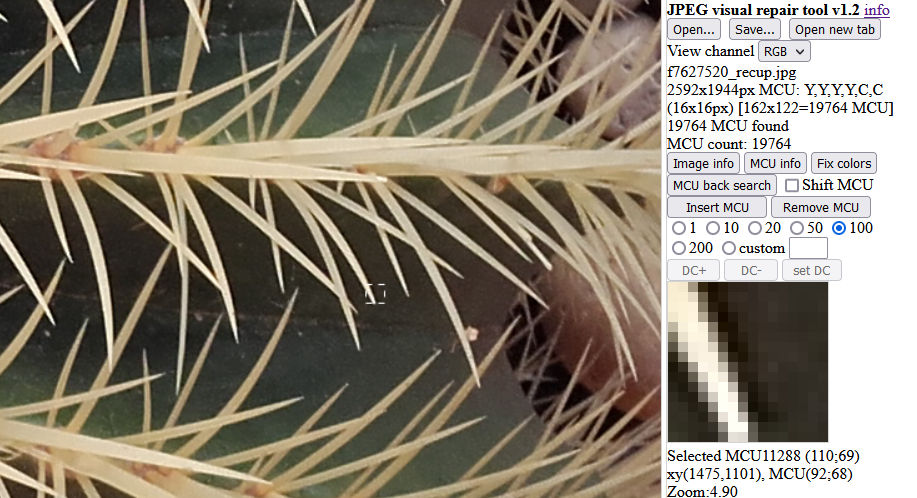

# JPEG Visual Repair Tool
</img>

JPEG Visual Repair Tool can load JPEG images while preserving MCU (Minimum Coded Unit) coding data and allows editing at MCU level; the main purpose is to repair corrupted images.
It is written in JavaScript and resides in a single [html document](JPEGVisualRepairTool.html); it can be simply saved for offline use, there are no library dependencies. 
It is based on [jpeg-decomp](https://github.com/albmac/jpeg-decomp).

Using it you can:

- view image info
- delete, insert, copy, paste MCUs
- change DC level of each MCU
- view the image as RGB, Y, Cb, Cr
- automatically fix color differences
- view MCU pixel levels, coefficients, and binary data-stream

## Controls

- **mouse wheel** ⇒ zoom image
- **left click** ⇒ select MCU; a black or white rectangle appears on selected MCU
- **shift+left click** ⇒ extend selection
- **left button drag** ⇒ drag image
- **right click** ⇒ select MCU for color fixing; a red rectangle appears on selected MCU
- **right button drag** ⇒ extend selection for color fixing
- **esc** ⇒ unselect MCUs
- **ctrl-c** ⇒ copy selected MCUs
- **ctrl-v** ⇒ paste before selected MCU
- **ctrl-z** ⇒ undo last operation
- **del** ⇒ delete MCU
- **arrows** ⇒ change selected MCU
- **f** ⇒ zoom fit
- **i** ⇒ open MCU info dialog
- **s** ⇒ shift MCU rendering using left/right keys
- **1-2-3-4** ⇒ change view (RGB, Y, Cb, Cr)
- **] [** ⇒ zoom in/out

A crossed red rectangle appears on MCUs that produced decode errors.

**Limitations:** no support for progressive scans or arithmetic encoding.

## Quick start

Corrupted images can be edited block by block (MCU) without losing information; even bright or dark areas still contain the original details. The problem often lies in the DC levels of specific MCUs.

</img>

First align image features by deleting spurious MCUs (effect of corruption); the shift feature (s+arrows) comes handy in determining how many blocks to delete.

</img>

Equalize colors either manually (DC+/DC- while viewing a single channel) or automatically (using __Fix colors__ on right-selected MCUs)

</img>

Finally, save as a new image

For more details see the tutorial on [how to repair a corrupted JPEG image](RepairingCorruptedJpeg-JVRT.pdf) 

Or this video tutorial:

[</img>](https://www.youtube.com/watch?v=REYcgWHb33M&t=194s)
